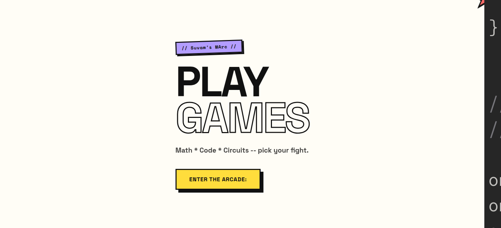
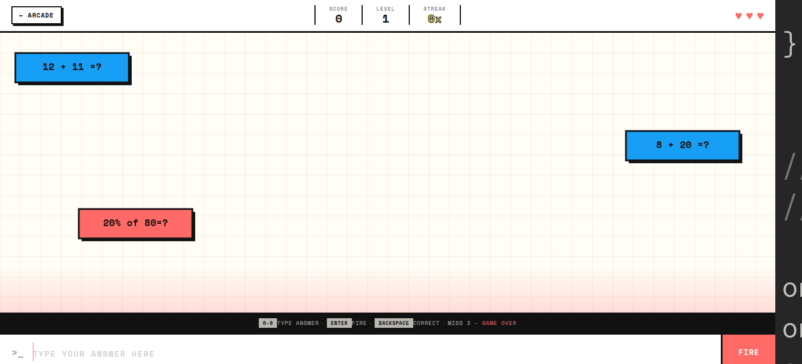
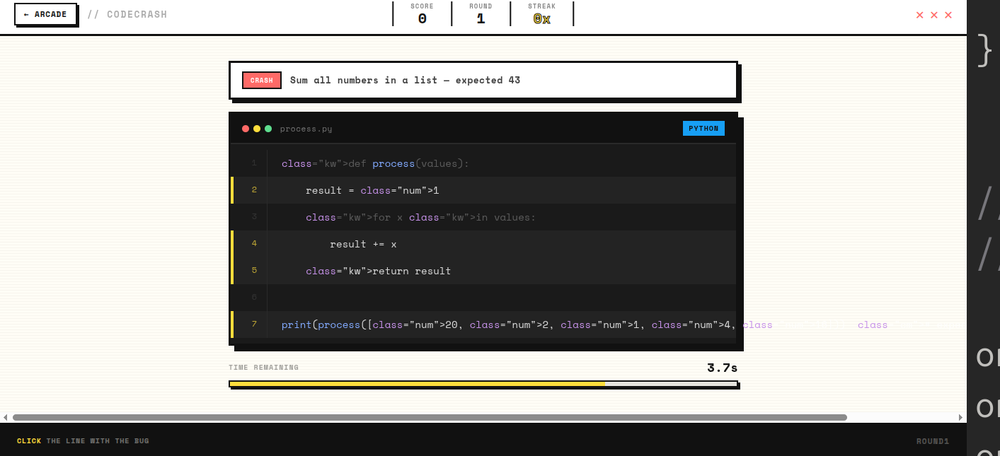
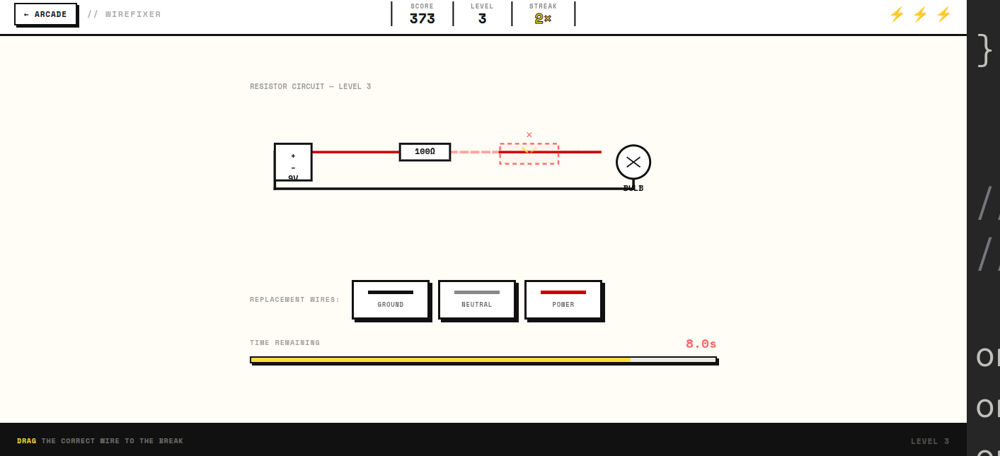
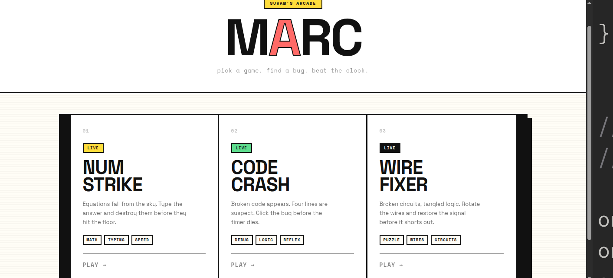

# Suvam's Mini Arcade
### MArc (Mini Arcade) is a neo brutalist-inspired collection of browser games - Math, code, and circuits, wrapped in one arcade. I made this arcade because my interests were in these 3 particular things and it is a game that feels like my own personal and others with similar thing can try too.

### Here's the Web link
[Click Here](https://suvamhere.github.io/MArc/)

### Here's the image of the main page
(I just noticed a peek of the my IDE is opened plz ignore that part and see the image)


## The currently available games are:

## NUMSTRIKE
### NUMSTRIKE is a math-under-pressure game- equation fall from the sky, and you have to solve them before they hit the ground . Miss three and it's game over. Difficulty scales from Easy to hard as you keep your streak alive.  
### Controls: [FILL IN - number input? on-screen buttons? Keyboard?]
### Difficulty: EASY to Hard (scaling)



## CODECRASH
### CODECRASH is another game based on coding mainly finding errors, It runs a piece of code line by line in front of you - and somewhere in there, it crashes. Your job is to spot the bug before the clock runs out. Tests reaction time as much as it tests understanding of code.

### Controls: [Fill In]
### Difficulty: MEDIUM



## WIREFIXER 
### WIREFIXER drops you into a broken circuit with exactly one snapped connection. Drag the correct replacement wire into the gao before thr timer runs out - get it wrong, and you lose one of your three lives. The timer shrinks and the pressure rises with every level you clear.

### Controls: Drag and drop (mouse or touch) - pick the correct wire type from the tray and drop it on the broken connection.
### Difficulty: HARD




## What is the motive behind MArc?? 

### The arcade is of three games which all align with my irl interests (as I really love to code , my favourite subject is maths and I have won many awards in Robotics) So I got this unqiue idea to make a mini arcade game of three exact niche that will be personally made for me and people like me around the world


## Main Page:
The  main page (for now) only shows a "Enter the game" button through which u get to the waiting room and then play the particular games. Initally my idea was to much more in the main page but for now I have focused on building games more than the design itself. 

### Waiting Room:
The waiting room has games list where u can click play and head to game's page
Pretty easy and user frendly



 
## NUMSTRIKE game:
### This game has a canvas API where equations drop randomly in the canavas but i had to make a template type for it as using canvas API was really hard I make different categories and put difficulty as the game increases

## CODECRASH game:
### This game uses basic web coding to manage the fast-paced game features, like the ticking countdown timer, point multipliers, and player health bars. To make the code snippets look realistic, a custom text-matching setup automatically colors words—like keywords, numbers, and comments—as they load on your screen. Everything runs directly inside your web browser, and it saves your personal all-time high scores on your device so they are ready for your next session.
 
## WIREFIXER game:
This game works using inline SVG, generated and controlled entirely from JavaScript — no static circuit image. Each round:
- Renders a battery-to-bulb loop with one wire segment broken (top or bottom side, picked at random).
- Assigns the broken wire one of four real-world wire types — power, ground, signal, neutral — each with its standard color.
- Offers three draggable wire cards in the tray: the correct type plus two shuffled distractors.
- Uses pointer events (not native HTML5 drag-and-drop) so dragging works identically on desktop and mobile/touch.
- Tracks score, level, streak, and lives in the HUD; timer shrinks and points scale up as levels increase.
- Stores your best score locally via `localStorage`, independent of the site-wide Supabase leaderboard.
## Setup Instructions
### If you want to run this locally, clone the repository:
```
git clone https://github.com/SuvamHere/MArc
```
### I used AI for js part of Wirefixer because I am in the deadline to submit and i can't learn that fast so i Had to take help of AI to debug my wirefixer as it was not wroking previously